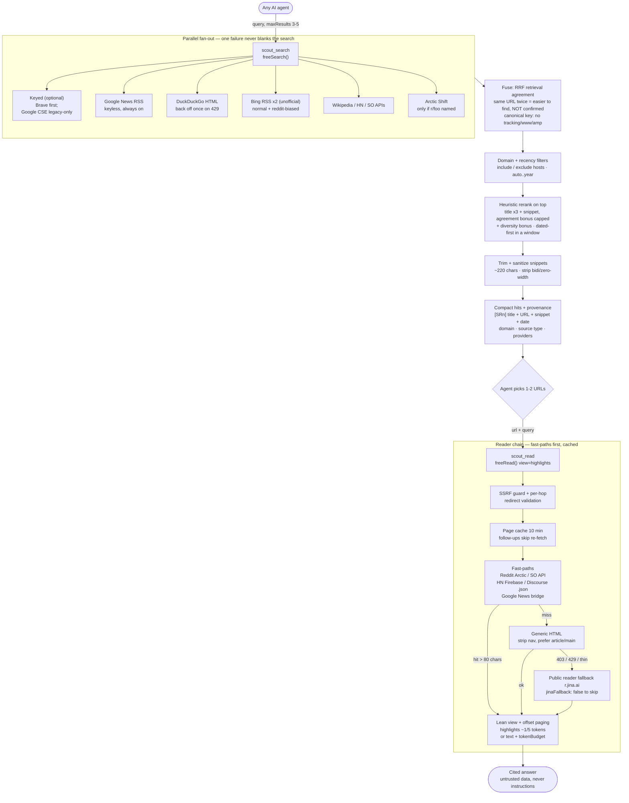

# Scout — lean web search + reader for any AI agent

Free-first, provider-agnostic web search + universal page reader. Token-efficient by design: highlights-first excerpts, reranked snippets, token budgets. Flat string/integer/boolean params so DSH, MCP, or OpenAI-style function calling can all use it. No API key needed.

## What you get

| Tool | What it does |
|---|---|
| `scout_search` | **Free-first, provider-agnostic**: optional keyed backends (**Brave** first when a key is set; **Google CSE legacy-only**, see below) + keyless free backends (DuckDuckGo HTML, **Bing RSS** — unofficial endpoint — Google News RSS, extra reddit-biased pass) + specials (Wikipedia, HackerNews, StackExchange, plus **Arctic Shift** when you name a subreddit (`r/foo`)). Handles `site:` queries. |
| `scout_read` | Reads a URL as clean text. **Reddit threads** (post + top comments via Arctic Shift), **subreddit digests**, **StackOverflow** (question + top answers via API), **HN threads** (via Firebase API), **Discourse** (`…json`), generic articles, plus a public-reader fallback for 403/429 pages. |
| `web` providers `scout` | Also plugs into the built-in `web_search` / `web_fetch` tools, so they work with no key configured. |

## How it works

Transparent by design: plain `fetch()` + string parsing, zero npm dependencies, no tracking. One search-side memory (Google News headline bridge, 30 min) and one reader-side page cache (cleaned text, 10 min, 50 entries). Every backend is failure-isolated behind a circuit breaker — one throttled or changed endpoint never blanks a search.



Lean rule: **highlights-first, never both views at once** — `view: 'highlights'` needs `query` (extractive, order preserved), `tokenBudget` caps at `budget × 4` chars on a sentence boundary.

## Install (this profile)

Already installed as a linked bundle (`scout-dsh`). After any code change:

1. **Restart the DSH app** (the host requires a restart to load plugin updates — the installer reports `restart-required`).
2. Verify: `mount-status.json` (next to `index.js`) appears after boot, e.g.
   `{"build": "0.4.0", "searchProvider": "registered", "tools": {"scout_search": "registered-via-…", …}}`.
3. Tools `scout_search` / `scout_read` are now available to agents, and `web_search` keeps working even with no `ANYSEARCH_API_KEY`.

Fresh install elsewhere:

```powershell
# from the plugin folder
dsh plugin add ./Scout-dsh
# or: DSH GUI → Settings → Plugins → Install → pick the folder
```

Or raw npm-style (after publishing):

```powershell
npm install ./Scout-dsh
```

Then restart `dsh web` (or reload the profile). Tools `scout_search` / `scout_read` appear, and `web_search` keeps working even with no `ANYSEARCH_API_KEY`.

## Providers: free-first ladder (Google CSE is legacy)

Scout is provider-agnostic. The serving order per search:

1. **Optional keyed backends** (skipped when no keys are set)
   - **Brave Search API** — the recommended keyed primary. Export `BRAVE_API_KEY`
     (~$5/mo free credits, then ~$5/1k requests). Slots in **first**, ahead of
     all keyless backends; if it ever fails, the keyless backends still cover.
   - **Google Custom Search (CSE) — legacy only.** Google closed the CSE JSON API
     to new customers, and existing customers must migrate off it by
     **January 1, 2027**. Kept working for keys issued earlier (set `googleCx`
     + export `GOOGLE_API_KEY`); do not build new setups around it.
2. **Free/keyless backends (always on)** — DuckDuckGo HTML (general web, handles
   `site:` natively), Google News RSS (real Google coverage for news/current,
   no signup), Bing RSS (general web + the reddit-biased pass — note this is an
   **unofficial public endpoint**, not the retired keyed Bing Search API, and can
   change or be blocked without notice).
3. **Specialized free sources** — Wikipedia OpenSearch, HN Algolia, StackExchange
   API, Arctic Shift (Reddit full-text, only when a subreddit is named).
4. **Optional self-hosted metasearch** — SearXNG via `SEARXNG_URL` (planned, see
   #7; not implemented yet).

Why not scrape google.com? Its HTML is a JS shell — results render
client-side, so plain-HTTP scraping returns zero links. News RSS is the honest
keyless Google backend; Brave is the honest keyed one.

## Keyed providers (optional): Brave primary, Google CSE legacy

Keyless HTML/RSS endpoints are undocumented and can change or be blocked
without notice. If that happens — or you just want better relevance — export
`BRAVE_API_KEY` (configure the env name via `braveApiKeyEnv`). Brave's Web
Search API then slots in **first**, ahead of all keyless backends; if it ever
fails, the keyless backends still cover. Same pattern fits any future keyed
provider (Serper, etc.): one `searchX()` function + one entry in the backend
list, failure-isolated by the same circuit breaker.

A local daily counter also guards the legacy Google CSE quota (~95/day) for
setups that still carry an old key; News RSS covers the rest. New setups
should use Brave, not CSE.

## Config

All optional (defaults work, tuned for low tokens):

- `maxResults` (default 8) — search result cap 1–20 (use 3–5 to save tokens)
- `snippetChars` (default 220, 80–500) — per-snippet cap; smaller = fewer tokens
- `rerank` (default true) — RRF fusion + heuristic rerank with per-source diversity guard
- `alternatives` (default `''`) — up to 4 alternate queries, newline-separated; every variant searches, one fused/deduped/reranked list returns (a 5th errors)
- `recency` (default `'auto'`) — `auto|day|week|month|year|all`; auto detects latest/today/version/price/year hints. With any window (explicit or auto-resolved), confirmed-fresh results outrank `date: unknown`; undated results are always kept, never dropped
- `redditBias` (default `'auto'`) — extra reddit pass for opinion/experience queries; `on`/`off` to force
- `includeDomains` / `excludeDomains` (default `''`) — comma-separated hosts (`"github.com, *.substack.com"`)
- `searchTimeoutMs` (default 12000)
- `fetchTimeoutMs` (default 15000)
- `maxChars` (default 8000, 500–50000) — full-text cap (~2000 tokens)
- `withLinksSummary` (default false) — append `## Links` URL list (off saves tokens)
- `jinaFallback` (default true) — use the public text proxy (`r.jina.ai`) when a page blocks direct fetch. **Privacy:** the requested URL is sent to that third party — set `false` for sensitive deployments and use another result instead.
- `googleApiKeyEnv` (default `'GOOGLE_API_KEY'`) — env var holding a pre-existing CSE key (legacy only — closed to new customers, discontinued 2027-01-01)
- `googleCx` (default `''`) — Programmable Search Engine ID (empty = News RSS tier; new setups should not use this)
- `braveApiKeyEnv` (default `'BRAVE_API_KEY'`) — env var holding the Brave key (empty = keyless backends only)

## Lean workflow (cheapest first — for humans and agents)

1. `scout_search` with `maxResults: 3-5` → compact hits with `~N tokens` counts and dates (`· 2026-03-06`) where known. Every hit carries a stable `[SRn]` id plus domain and source type (`official-docs|reference|news|community|aggregator|unknown`) — cite the id. Provider outages surface as a `Partial results:` footer (or an explicit all-failed message), never as silent thin results. For hard questions add `alternatives` (up to 4 reformulations, one per line) — variants fan out, one fused ranking returns. `recency` defaults to `auto` (detects current-topic hints); set it explicitly only to override.
2. `scout_read { url, query, view: 'highlights' }` → extractive excerpts (~1/5 tokens). Needs both `query` + `view`.
3. Follow-ups are free: the cleaned page is cached 10 min, so a second question costs no re-fetch. Long pages say `Continue with offset=N` — pass it back to page through.
4. Only if the answer is missing: re-read with `view: 'text'` + `tokenBudget: 2000`.
5. Never request both views at once (paid APIs bill twice for the same reason).

## How it reads Reddit / forums

1. `reddit.com/…/comments/…` → Arctic Shift (post + top comments; reddit.com 403s anonymous `.json`, so Arctic is the real path).
2. Subreddit homepages → recent-posts digest via Arctic.
3. StackOverflow / StackExchange questions → question + top answers via the free API (direct HTML 403s bots).
4. HN items → story + top comments via the Firebase API.
5. Discourse `/t/slug/id` → tries `…json`, returns topic + first 10 posts.
6. Anything else → fetches HTML with a browser UA, strips nav/script/footer, prefers `<article>`/`<main>`, converts to markdown-ish text.
7. Blocked (403/429/empty) → retries through the public reader proxy (`r.jina.ai`, no key) — see the privacy note in Config.

Private/local targets are refused — SSRF guard covers IPv4 (incl. hex/octal forms, `0.0.0.0`, CGNAT `100.64/10`), IPv6 (loopback, link-local, unique-local, mapped), `.localhost/.local/.internal`, dotless hosts, and re-validates every redirect hop.

## Limits (honest)

- Keyless Google = News RSS (fresh/current queries shine; obscure `site:` scoping is weaker — Brave covers full-web relevance; the legacy CSE key path works only for pre-existing keys until 2027-01-01).
- Keyed Bing Search APIs were retired by Microsoft (2025-08-11) — Scout's Bing RSS backend is a separate unofficial public endpoint, kept failure-isolated like every other keyless backend.
- DuckDuckGo throttles aggressive IPs (429/202) — a circuit breaker skips a throttled backend for ~3 min instead of paying a backoff on every search; other backends cover meanwhile. Suspect queries degrade to honest-empty rather than junk (Bing results must share a query term; DDG ad links are dropped).
- The extra reddit-biased Bing pass runs only for opinion/experience queries (or `redditBias: 'on'`) — factual queries aren't forum-biased and Bing isn't hit twice.
- Same URL in two engines fuses by Reciprocal Rank Fusion (canonical key strips tracking params, `www.`, `http/https`, AMP variants) — but read it as **retrieval agreement** (easy to find), not independent confirmation: same-host multi-provider hits report `providerCount` separately from `independentHostCount`, and the rerank agreement bonus is capped so it can never swamp lexical relevance. A canonical miss can still duplicate; the heuristic rerank sits on top, not instead.
- Dates come from backends that expose them (News/Bing RSS, HN, SO, Arctic); DDG/Wikipedia/CSE don't, and undated results are kept under `recency` filters rather than dropped.
- Reddit's own `.json` 403s without OAuth (Arctic covers threads; very fresh posts take a while to index).
- No JS rendering — heavy SPA pages return their static HTML text. No PDFs.
- Token counts are `chars/4` estimates: fine for English budgeting, overcounts CJK and code — never presented as precise.
- SSRF honesty: no raw-socket DNS pinning without extra deps, so DNS-rebinding inside a short TTL is mitigated (short timeouts + per-hop validation), not eliminated.
- Zero npm dependencies, Node 20+.

## Test

```powershell
# Offline (no network): pure helpers/parsers, reader fixtures, SSRF hard
# gate, provider chaos, frozen ranking bench (L1-L5 gates — see #8):
npm test
# or per suite:
node ./test/lean-check.mjs
node ./test/reader-check.mjs
node ./test/ssrf-check.mjs
node ./test/chaos-check.mjs
node ./test/ranking-bench.mjs
# Live backends + plugin mount:
node ./test/smoke.mjs "best android pomodoro apps reddit"
node ./test/check-plugin.mjs
```

---

Made with ✨ Muse Spark 1.3 Contributor ✨ — lean, transparent, and free for any agent.
