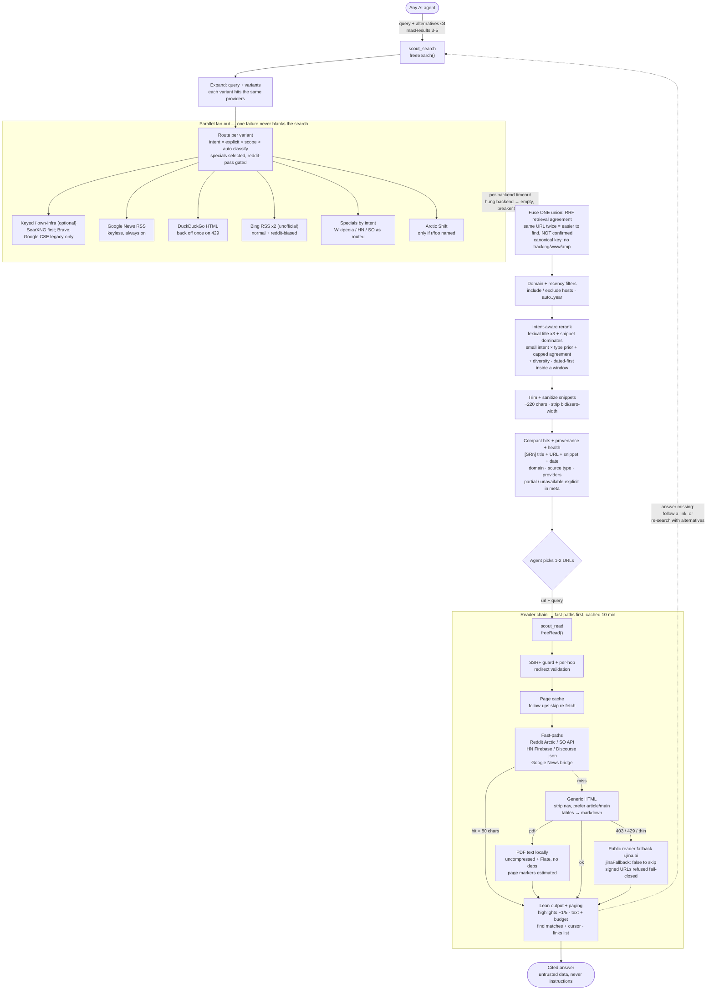

# Architecture — how Scout works

Scout is deterministic plumbing: plain `fetch()` + string parsing, zero npm dependencies, no tracking, no internal LLM, no summarizer. The [agent](../GLOSSARY.md) decides what to do; Scout finds, fetches, extracts, compresses, caches, and returns [evidence](../GLOSSARY.md) with [provenance](../GLOSSARY.md) so the agent can judge it. See `adr/0001-agent-owns-judgment-scout-owns-plumbing.md` for the change gate.

## Pipeline

## Retrieval modes

**Request only the retrieval mode you need.** `highlights`, `text`, `links`, and `find` are mutually prioritized; Scout never returns multiple full representations of the same page in one response — `view: 'highlights'` needs `query` (extractive, order preserved), `tokenBudget` caps at `budget × 4` chars on a sentence boundary. `view: 'links'` returns the page's link list (anchor + URL + internal/external) for traversal — follow subpages without guessing URLs. `find: 'phrase'` locates exact passages with section + offset + context (page `findCursor` for more matches) and wins over `view` when both are given. `links` and `find` run over the **full cached source**, not an offset window; output caps still apply. `<table>`s survive as compact markdown.

## Fusion and ranking

- Same URL in two engines fuses by Reciprocal Rank Fusion (canonical key strips tracking params, `www.`, `http/https`, AMP variants) — but read it as **retrieval agreement** (easy to find), not independent confirmation: same-host multi-provider hits report `providerCount` separately from `independentHostCount`, and the rerank agreement bonus is capped so it can never swamp lexical relevance. A canonical miss can still duplicate; the heuristic rerank sits on top, not instead.
- Ranking: lexical title ×3 + snippet dominates; a small intent × source-type prior (docs win technical, forums win opinion) never swamps lexical relevance; per-source diversity guard; dated-first inside a window. `rerank: false` disables fusion + heuristic rerank for A/B comparisons.
- Live retrieval precision varies by backend: Bing RSS has loose OR-semantics, so ambiguous queries surface noise (e.g. "Studio" pulls YouTube Studio above Android Studio). Ranking demotes junk but can't conjure precision the backends didn't return.

## Caches and isolation

- One search-side memory (Google News headline bridge, 30 min) and one reader-side page cache (cleaned text, 10 min, 50 entries). Follow-up questions on the same page cost no re-fetch.
- Every backend is failure-isolated behind a circuit breaker with per-backend timeouts — one throttled or changed endpoint never blanks a search. A throttled DuckDuckGo backend is skipped for ~3 min instead of paying a backoff on every search; other backends cover meanwhile.
- Suspect queries degrade to honest-empty rather than junk (Bing results must share a query term; DDG ad links are dropped).

## Dates and provenance

Dates come from backends that expose them (News/Bing RSS, HN, SO, Arctic); DDG/Wikipedia/CSE don't, and undated results are kept under `recency` filters rather than dropped. With any window (explicit or auto-resolved), confirmed-fresh results outrank `date: unknown`. `sourceType` (`official-docs|reference|news|community|aggregator|unknown`) is a coarse label for judging provenance, not a verdict.

## Honest ceilings

- No JS rendering — heavy SPA pages return their static HTML text.
- English-first throughout (`hl=en-US` defaults); non-English queries are underserved.
- Token counts are `chars/4` estimates: fine for English budgeting, overcounts CJK and code — never presented as precise.
- PDF text has ligature breakage ("Intr oduction", "netw orks") that can defeat `find`/highlights term matching; page numbers are positional estimates.
- Zero npm dependencies, Node 20+.
