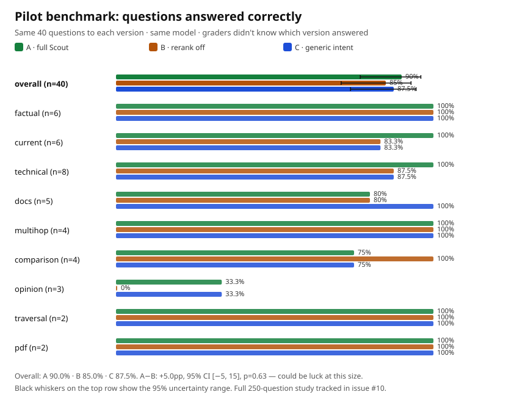

# Benchmarks — regression guards, not proof

## Test

```powershell
# Offline (no network) — the quality gates, all must-pass:
npm test
# or per suite:
node ./test/lean-check.mjs      # L1: helpers, backend parsers, 20-URL canon, ranking fixtures (155 asserts)
node ./test/reader-check.mjs    # L2: 10 page fixtures, paging reconstruction, redirect-hop guard, links/find/tables/PDF
node ./test/ssrf-check.mjs      # L3: 59-case SSRF hard gate — any miss fails the build
node ./test/chaos-check.mjs     # L4: 1-down/2-down partial, all-down honest-empty, hang degraded, breaker skips
node ./test/ranking-bench.mjs   # L5 starter: 30 frozen queries, Recall@10 ≥ 0.85 gate + MRR/nDCG vs rerank:false
# Live backends + plugin mount:
node ./test/smoke.mjs "best android pomodoro apps reddit"
node ./test/check-plugin.mjs
```

### Regression benchmark
Tests Scout implementation quality. The frozen bench measures the ranking layer only (golds are present in canned backend lists, so MRR/nDCG discriminate, not recall). Whether agents solve more tasks is tracked separately as a paired live A/B benchmark below — the gates above are regression guards, not proof.

### Agent benchmark (pilot, Oct 2026)
Tests whether Scout actually helps models solve tasks.

We gave the same 40 questions to three versions of Scout — **A** full, **B** with reranking switched off, **C** with intent routing switched off — all on the same model, and graders who didn't know which version answered scored every run for correctness and citations.



In plain words:

- Full Scout answered **36 of 40**. The simplified versions answered 34–35. A small lead — and with only 40 questions it could still be luck (the black whiskers show the uncertainty range).
- Easy lookups (capitals, equations, who-wrote-what) every version aces, so those rows can't tell versions apart.
- Technical questions separate them: full Scout went 8/8 while the others dropped answers (a missed `repeatOnLifecycle`, a missed multi-stage build).
- Opinion questions ("which apps do people actually stick with?") are hard for *everyone* — finding threads is easy, turning them into properly attributed experiences is not.
- One surprise: on a bot-walled Android docs page, only a simplified version succeeded (via a blog mirror). Luck of retrieval still matters.
- Citations held up: about 9 in 10 claims carried a proper citation with full Scout.

What this doesn't prove (yet): 40 questions can't confirm the +5-point gate — that's the full 250-question study, tracked in issue #10. And there was no non-Scout baseline here (the built-in search in the test setup was broken), so this compares Scout against itself with features removed. 4 of the 240 runs crashed and were counted as failures.

Reproduce it: questions in `test/bench/tasks-pilot.json`, scores in `pilot-rows.json`, stats with `node ./test/bench/pilot-stats.mjs`, the chart above with `node ./test/bench/pilot-chart.mjs`.
